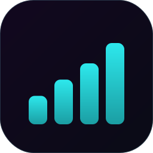
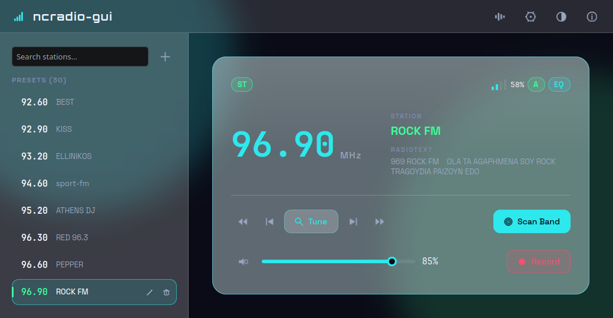

<p align="center">
  
</p>

<h1 align="center">ncradio-gui</h1>

<p align="center">A Qt6/QML desktop front-end for <a href="#relation-to-ncradio">ncradio</a>, a V4L2 FM radio controller for Linux.</p>



## What it is

ncradio-gui is a graphical FM radio tuner for Linux boxes with a V4L2-compatible
tuner card or USB radio stick exposed as `/dev/radio0` (tested with the ADS
Tech InstantFM Music RDX-155). It tunes, seeks, and band-scans the device,
decodes RDS (station name + radiotext), pipes the tuner's captured audio to
PipeWire or ALSA for live playback, applies an 11-band equalizer, and records
the stream to WAV/MP3/OGG Vorbis/FLAC.

It's a graphical sibling of the ncurses tool **ncradio**, not a rewrite —
see [Relation to ncradio](#relation-to-ncradio).

## Screenshot

The screenshot above shows the main "Now Playing" view: the preset sidebar
on the left (search, add, edit, delete), and the tuner card on the right
(signal meter, stereo/RDS status, frequency, transport controls, volume,
and record).

## Relation to ncradio

[ncradio](https://github.com/ceetee91/ncradio) is the original ncurses/terminal FM radio controller.
ncradio-gui does not reimplement its logic — it **vendors ncradio's C
engine wholesale** and puts a Qt/QML UI on top of it:

- `backend/` is a straight copy of ncradio's core C sources — `radio.c`
  (V4L2 tuning/seek/scan), `rds.c` (RDS decoding), `audio.c`
  (PipeWire/ALSA capture→playback pipe), `record.c` + per-format encoders
  (`record_wav.c`/`record_mp3.c`/`record_ogg.c`/`record_flac.c`),
  `resample.c` (libsamplerate), `eq.c` (11-band equalizer), and
  `config.c` — built here as a static library, `ncradio-backend`.
- `src/*.cpp` wraps that C engine in Qt `QObject` controllers
  (`RadioController`, `AudioController`, `RecordController`,
  `EqController`, `ConfigStore`) that expose it to QML as properties and
  signals, polling the backend from a `QTimer` on the GUI thread the same
  way ncradio's own main loop polls it (`radio_get_signal`/
  `radio_read_rds` every ~500ms, checking scan/seek completion).
- `qml/` reimplements ncradio's terminal screens (now-playing, scan,
  settings, equalizer) as a graphical Kirigami/QtQuick UI, and its
  keyboard shortcuts deliberately mirror ncradio's key bindings
  (`M_NORMAL`/`M_EQ`/`M_SETTINGS` modes — `S` scan, `R` record, `,`/`.`
  step, `<`/`>` seek, `Shift+E` equalizer, etc.), so a former ncurses user
  needs to unlearn nothing.
- Both apps also **share the same config/presets file**, `~/.ncradio.conf`
  (`backend/config.c`) — presets, EQ settings, and tuning options added in
  one are visible in the other. A handful of GUI-only settings that have
  no ncradio equivalent (recording destination folder, "skip filename
  prompt", light/dark theme) live separately in Qt `QSettings`
  (org `ncradio`, app `ncradio-gui`).

In short: ncradio is the engine and the reference behavior; ncradio-gui is
a modern UI wrapped around the exact same tuning/audio/recording code.

## Dependencies

**Runtime:**
- Linux kernel with V4L2 radio support (`/dev/radio0`)
- Qt6 (Core, Quick, QuickControls2, Qml) and KDE Frameworks 6 Kirigami
  (`org.kde.kirigami` QML module — resolved at the Qt QML import path,
  not linked at the C++ level)
- PipeWire (preferred) **or** ALSA (`libasound`) for audio output
  (optional — falls back to tuner control only, no playback/recording)
- `libudev` for automatic audio device autodetection (optional — falls
  back to sysfs)
- Recording to WAV needs no extra library; MP3 (`libmp3lame`), OGG
  Vorbis (`libvorbisenc`/`libvorbis`/`libogg`), and FLAC (`libFLAC`) are
  each optional and independent. `libsamplerate` (optional) lets
  WAV/OGG/FLAC record at a configured rate different from the capture
  rate; MP3 is unaffected since `lame` resamples internally.

**Build:**
- CMake ≥ 3.16, a C11/C++17 toolchain, `pkg-config`
- Qt6 development packages: `qt6-qtbase-devel`, `qt6-qtdeclarative-devel`
  (names vary by distro)
- KDE Frameworks 6 Kirigami development files (`kf6-kirigami-devel` /
  `kirigami2-dev`, distro-dependent)
- `libpipewire-0.3` development headers — preferred audio backend
- `alsa-lib` development headers (`alsa-lib-devel` / `libasound2-dev`) —
  fallback if PipeWire isn't found
- `libudev` development headers (`systemd-devel` / `libudev-dev`) —
  optional
- `lame` development headers (`lame-devel` / `libmp3lame-dev`) —
  optional, MP3 recording
- `libvorbis`/`vorbis-devel` development headers — optional, OGG
  recording
- `flac` development headers (`flac-devel` / `libflac-dev`) — optional,
  FLAC recording
- `libsamplerate` development headers — optional, resampling for
  WAV/OGG/FLAC

## How it's built

```sh
cmake -S . -B build
cmake --build build -j$(nproc)
```

The resulting binary is `build/src/ncradio-gui`; run it with an optional
device path argument (defaults to `/dev/radio0`):

```sh
build/src/ncradio-gui [/dev/radioN]
```

CMake auto-detects everything under `find_package(PkgConfig)`/
`pkg_check_modules` — PipeWire vs. ALSA, libudev, and each recording
codec — and only compiles in what's found, mirroring `/data/ncradio`'s
own `./configure` script. Each feature can also be forced off explicitly
with a CMake option:

| Option | Effect |
|---|---|
| `NCRADIO_DISABLE_AUDIO` | Build without audio support at all |
| `NCRADIO_DISABLE_PIPEWIRE` | Prefer ALSA even if PipeWire is available |
| `NCRADIO_DISABLE_UDEV` | Disable libudev; sysfs-only device autodetection |
| `NCRADIO_DISABLE_RECORD` | Build without recording support (including WAV) |
| `NCRADIO_DISABLE_LAME` | Build without MP3 recording support |
| `NCRADIO_DISABLE_VORBIS` | Build without OGG Vorbis recording support |
| `NCRADIO_DISABLE_FLAC` | Build without FLAC recording support |
| `NCRADIO_DISABLE_SAMPLERATE` | Build without libsamplerate |
| `NCRADIO_DISABLE_EQ` | Build without the 11-band equalizer |
| `NCRADIO_BUILD_GUI` | Set to `OFF` to build only the `ncradio-backend` static library, no Qt frontend |

e.g. `cmake -S . -B build -DNCRADIO_DISABLE_LAME=ON` builds without MP3
support.

QML sources are compiled into the binary (Qt resource system + AOT
qmlcache), not loaded from disk at runtime, so a QML-only change still
needs a real rebuild — editing a `.qml` file and restarting isn't enough.

## How it works

- **Two-tier architecture.** `backend/` is plain C with no Qt
  dependency — it's the same code ncradio's ncurses build compiles. `src/`
  is a thin Qt/C++ adapter layer: one controller `QObject` per backend
  subsystem, each holding the corresponding C struct (`Radio`, `Audio`,
  `Eq`, `Record`) and exposing its fields/operations as `Q_PROPERTY`s,
  `Q_INVOKABLE`s, and signals for QML to bind against.
- **GUI-thread polling, not a worker thread.** `RadioController` drives
  a `QTimer` on the GUI thread that calls into the backend roughly twice
  a second to read signal strength, RDS data, and scan/seek completion —
  the same polling pattern as ncradio's own main loop, safe because the
  backend's tuning/scanning calls are non-blocking and documented as
  thread-safe for this usage.
- **A separate audio thread for the capture→playback pipe.**
  `AudioController` owns `audio.c`'s PipeWire/ALSA pipe, which runs its
  own realtime audio thread. Recording taps that thread via a callback
  (`Audio::rec_fn`/`rec_ctx`) rather than a second capture stream;
  `RecordController::start()`/`stop()` install/remove that callback
  under `audio->rec_lock`, then close the encoder outside the lock so
  the audio thread is guaranteed not to be mid-callback into it.
- **One shared config file.** `ConfigStore` loads/saves the same
  `~/.ncradio.conf` (`backend/config.c`) that ncradio uses — station
  presets, scan/seek settings, EQ bands and custom presets, and
  per-format recording settings (bitrate/quality/sample rate/stereo,
  independently for WAV/MP3/OGG/FLAC). A few GUI-only conveniences with
  no ncradio equivalent (recording destination folder, skip-filename-
  prompt, light/dark theme) are stored separately via Qt `QSettings`.
- **Recording is stateful.** While a recording is in progress, station
  changes (presets, step/seek/manual tune) and starting a band scan are
  disabled in the UI, and `R`/`S`/`Escape` all stop the recording instead
  of their normal action — so a recording session always corresponds to
  one continuous station.
- **Mute-while-busy.** If the corresponding setting is on, audio output
  is paused for the duration of a scan or a seek and resumed once it
  finishes (`Main.qml`, mirroring ncradio.c's own behavior).
- **Pages.** `qml/pages/NowPlayingView.qml` is the main screen (preset
  sidebar + tuner card); `SettingsPage.qml` covers General/Tuning, Audio,
  and Recording settings; `EqualizerPage.qml` is the full-screen 11-band
  EQ with built-in presets (Flat, Rock, Pop, Classical, Jazz, Electronic)
  plus user-saved custom presets.

## Keyboard shortcuts

### Now Playing (main screen)

| Key | Action |
|---|---|
| `S` | Start band scan — **stops recording** if one is active |
| `R` | Start/stop recording (opens the filename dialog unless "don't ask for filename" is on) |
| `Escape` | Stop recording if active, else discard an in-progress scan |
| `,` / `.` | Step down / up to the next preset step |
| `<` / `>` | Seek backward / forward |
| `T` | Open manual tune dialog |
| `Return` / `Enter` | Tune to the selected preset |
| `Up` / `Down` | Move preset selection |
| `PgUp` / `PgDown` | Move preset selection by a page |
| `A` | Add the current frequency as a preset |
| `E` | Rename the selected preset |
| `D` | Delete the selected preset |
| `+` / `=` | Volume up |
| `-` / `_` | Volume down |
| `M` | Toggle mute |
| `O` | Open Settings |
| `Shift+E` | Open Equalizer |
| `Q` | Quit |

Tuning/scan actions are disabled while a scan or a recording is active, and
whenever a text field (e.g. the preset search box) has focus.

### Settings

| Key | Action |
|---|---|
| `Escape` / `O` | Back to Now Playing |

### Equalizer

| Key | Action |
|---|---|
| `Escape` / `Shift+E` | Back to Now Playing |
| `Space` | Toggle EQ on/off |
| `[` / `]` | Cycle to previous/next preset |
| `0` | Load the flat (no EQ) preset |
| `S` | Save current bands as a new custom preset |
| `Delete` | Delete the active preset (custom presets only) |

All dialogs close on `Escape` or on a click outside them. The ones with a
text field (manual tune, preset rename/add, record filename) also confirm
on `Enter`.
